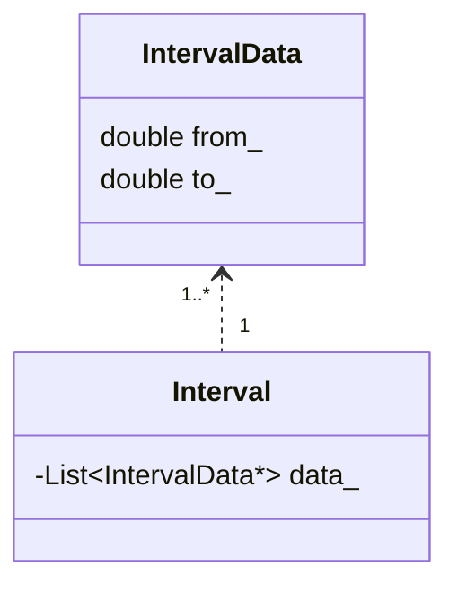
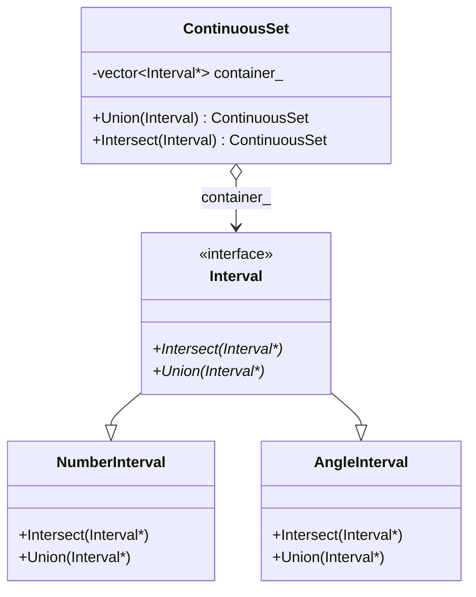

Interval class는 연속적인 집합을 다루기 위한 클래스입니다.

연속적인 집합이란 예들 들면 $x = \{x| x \in [0,1]\}$와 같은 형태의 수식을 다음과 같이 나타내는 것을 의미합니다.
```cpp
class Interval {
    Interval(double from, double to);
  private:
    double from_;
    double to_;
};

int main() {
    Interval x_interval(0, 1);
}
```

Interval 클래스는 집합에서 제공하는 기본적인 연산들을 제공합니다. 가령 합집합($\cup$), 교집합($\cap$), 차집합($-$) 등을 지원합니다. 또한, 특정 변수가 해당 Interval 내에 포함되는지 확인하거나, 두 Interval이 서로 겹치는 영역이 있는지 확인할 수 있어야 합니다.



연속된 숫자들의 집합을 계산하기 위해 ContinuousSet 클래스를 도입

